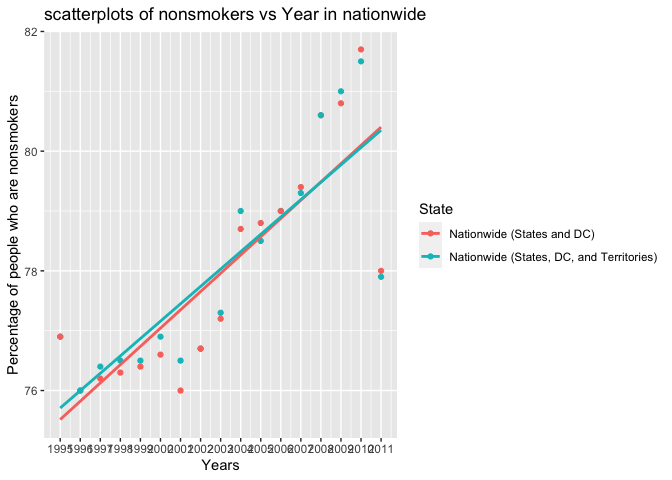
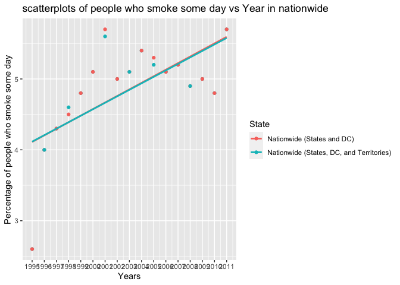
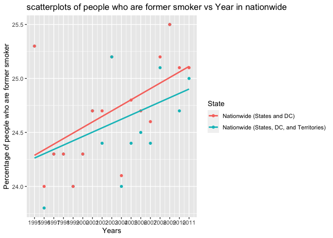

# Introduction (provide background on your dataset and formulated question)

Methods (include how and where the data were acquired, how you cleaned and wrangled the data, what tools you used for data exploration), 
Preliminary Results (provide summary statistics in tabular form and publication-quality figures, take a look at the kable function from knitr to write nice tables in Rmarkdown), 
and a brief Conclusion about what you found in terms of the formulated question.

Introduction:
Methods:

# Part 1 Data Cleaning and Wrangling

## Step1 reading and combining the data sets

```r
tobacco10 <- data.table::fread("tobacco2010.csv")
tobacco11 <- data.table::fread("tobacco2011.csv")
location <- data.table::fread("location.csv")
tobacco <- rbind(tobacco10, tobacco11)
tobacco11_L <- merge(tobacco11, location, by = "State")
```
tobacco11_L missed two obs, but it's fine, we don't want nationwide in map. 

## Step2 creating two new variables "smokers and nonsmokers"

```r
tobacco[, smokers := `Smoke everyday`+`Smoke some days`]
tobacco[, nonsmokers := `Former smoker`+`Never smoked`]
```

## Step3 Spliting the data sets

```r
count(tobacco, 'State')
```

```
##    "State"   n
## 1:   State 931
```

```r
nation <- tobacco[State == "Nationwide (States and DC)" | State == "Nationwide (States, DC, and Territories)"]
area <- tobacco[!State == "Nationwide (States, DC, and Territories)" & !State == "Nationwide (States and DC)"]
```


# Part 2 Looking at the Data
## Step 1 Looing at smokers and nonsmokers overall in nationwide and statewide respectively
Smokers nationwide:

```r
ggplot(data = nation, mapping =aes(x = Year, y=smokers, color = State)) +
  geom_point() +
  xlab("Years") + ylab("percentage") + 
  geom_smooth(method=lm,se=FALSE, fullrange=TRUE) +
  scale_x_continuous(limits=c(1995, 2011), breaks = seq(1995, 2011, 1))
```

```
## `geom_smooth()` using formula 'y ~ x'
```

<!-- -->

Smokers in statewide

```r
ggplot(data=area, mapping=aes(x = Year, y = smokers)) +
  geom_point() + 
  facet_wrap(~State) +
  geom_smooth(method='lm', formula = y~x)+
  labs(title = "scatterplots of smokers vs Year by State", x="Yeas", y="Percentage of people who are smokers")
```

<!-- -->

Nonsmokers nationwide:

```r
ggplot(data = nation, mapping =aes(x = Year, y=nonsmokers, color = State)) +
  geom_point() +
  xlab("Years") + ylab("percentage") + 
  geom_smooth(method=lm,se=FALSE, fullrange=TRUE) +
  scale_x_continuous(limits=c(1995, 2011), breaks = seq(1995, 2011, 1))
```

```
## `geom_smooth()` using formula 'y ~ x'
```

<!-- -->


Nonmokers in statewide

```r
ggplot(data=area, mapping=aes(x = Year, y = nonsmokers)) +
  geom_point() + 
  facet_wrap(~State) +
  geom_smooth(method='lm', formula = y~x)+
  labs(title = "scatterplots of smokers vs Year by State", x="Yeas", y="Percentage of people who are smokers")
```

<!-- -->

## Step 2 Looing at 4-level of tobacoo use in nationwide and statewide respectively


Smoke everyday in nationwide

```r
ggplot(data = nation, mapping =aes(x = Year, y=`Smoke everyday`, color = State)) +
  geom_point() +
  xlab("Years") + ylab("percentage") + 
  geom_smooth(method=lm,se=FALSE, fullrange=TRUE) +
  scale_x_continuous(limits=c(1995, 2011), breaks = seq(1995, 2011, 1))
```

```
## `geom_smooth()` using formula 'y ~ x'
```

<!-- -->


Smoke everyday in statewide

```r
ggplot(data=area, mapping=aes(x = Year, y = `Smoke everyday`)) +
  geom_point() + 
  facet_wrap(~State) +
  geom_smooth(method='lm', formula = y~x)+
  labs(title = "scatterplots of 'Smoke everyday' vs Year by State", x="Yeas", y="Percentage of people who smoke everyday")
```

<!-- -->

Smoke some days in nationwide

```r
ggplot(data = nation, mapping =aes(x = Year, y=`Smoke some days`, color = State)) +
  geom_point() +
  xlab("Years") + ylab("percentage") + 
  geom_smooth(method=lm,se=FALSE, fullrange=TRUE) +
  scale_x_continuous(limits=c(1995, 2011), breaks = seq(1995, 2011, 1))
```

```
## `geom_smooth()` using formula 'y ~ x'
```

<!-- -->


Smoke some days in statewide

```r
ggplot(data=area, mapping=aes(x = Year, y = `Smoke some days`)) +
  geom_point() + 
  facet_wrap(~State) +
  geom_smooth(method='lm', formula = y~x)+
  labs(title = "scatterplots of 'Smoke some days' vs Year by State", x="Yeas", y="Percentage of people who smoke some days")
```

<!-- -->


Former smoker in nationwide

```r
ggplot(data = nation, mapping =aes(x = Year, y=`Former smoker`, color = State)) +
  geom_point() +
  xlab("Years") + ylab("percentage") + 
  geom_smooth(method=lm,se=FALSE, fullrange=TRUE) +
  scale_x_continuous(limits=c(1995, 2011), breaks = seq(1995, 2011, 1))
```

```
## `geom_smooth()` using formula 'y ~ x'
```

<!-- -->


Former smoker in statewide

```r
ggplot(data=area, mapping=aes(x = Year, y = `Former smoker`)) +
  geom_point() + 
  facet_wrap(~State) +
  geom_smooth(method='lm', formula = y~x)+
  labs(title = "scatterplots of 'Smoke some days' vs Year by State", x="Yeas", y="Percentage of people who are former smoker")
```

<!-- -->

Never smoked in nationwide

```r
ggplot(data = nation, mapping =aes(x = Year, y=`Never smoked`, color = State)) +
  geom_point() +
  xlab("Years") + ylab("percentage") + 
  geom_smooth(method=lm,se=FALSE, fullrange=TRUE) +
  scale_x_continuous(limits=c(1995, 2011), breaks = seq(1995, 2011, 1))
```

```
## `geom_smooth()` using formula 'y ~ x'
```

<!-- -->

Never smoked in statewide

```r
ggplot(data=area, mapping=aes(x = Year, y = `Never smoked`)) +
  geom_point() + 
  facet_wrap(~State) +
  geom_smooth(method='lm', formula = y~x)+
  labs(title = "scatterplots of 'Smoke some days' vs Year by State", x="Yeas", y="Percentage of people who are Never smoked")
```

<!-- -->
## Step 3 See percentage of smokers over the country in most recent year, 2011

```r
tem.pal <- colorNumeric(c('green','yellow','red'), domain=tobacco11_L$`Smoke everyday`)
leaflet(tobacco11_L) %>% 
  addTiles() %>%
  addCircles (lat = ~Latitude, lng = ~Longitude, color = ~tem.pal(`Smoke everyday`),
               label = ~`Smoke everyday`, 
               opacity=1, fillOpacity = 1, radius = 5000) %>%
  addLegend('bottomleft', pal= tem.pal, values = tobacco11_L$`Smoke everyday`,
             title ='percentage of smokers', opacity=0.5)
```

```{=html}
<div id="htmlwidget-fa70692e540c72e69ddf" style="width:672px;height:480px;" class="leaflet html-widget"></div>
<script type="application/json" data-for="htmlwidget-fa70692e540c72e69ddf">{"x":{"options":{"crs":{"crsClass":"L.CRS.EPSG3857","code":null,"proj4def":null,"projectedBounds":null,"options":{}}},"calls":[{"method":"addTiles","args":["//{s}.tile.openstreetmap.org/{z}/{x}/{y}.png",null,null,{"minZoom":0,"maxZoom":18,"tileSize":256,"subdomains":"abc","errorTileUrl":"","tms":false,"noWrap":false,"zoomOffset":0,"zoomReverse":false,"opacity":1,"zIndex":1,"detectRetina":false,"attribution":"&copy; <a href=\"http://openstreetmap.org\">OpenStreetMap<\/a> contributors, <a href=\"http://creativecommons.org/licenses/by-sa/2.0/\">CC-BY-SA<\/a>"}]},{"method":"addCircles","args":[[32.84057,64.84508,34.86597,34.74865,37.6383,38.84289,41.56266,39.00883,38.89037,28.93204,32.83968,13.45,21.30485,43.68259,40.48501,39.76691,42.46939,38.34774,37.64597,31.31266,45.25423,39.29058,42.27687,44.66132,46.35565,32.74551,38.63579,47.06653,41.64104,39.49324,43.65595,40.13057,34.52088,42.827,35.46625,47.47532,40.06021,35.47201,44.56745,40.79373,18.46633,41.70828,33.99855,44.35313,35.68094,31.82724,39.3607,43.62538,37.54268,47.52228,38.66551,44.39319,43.23554],[-86.63186,-147.72206,-111.76381,-92.27449,-120.99959,-106.13314,-72.64984,-75.57774,-77.03196,-81.92896,-83.62758,144.7833,-157.85775,-114.36368,-88.99771,-86.14996,-93.81649,-98.20078,-84.77497,-92.44568,-68.98503,-76.60926,-72.08269,-84.71439,-94.7942,-89.53803,-92.5663,-109.42442,-99.36573,-117.07184,-71.50036,-74.27369,-106.24058,-75.54397,-79.15932,-100.11842,-82.40426,-97.52035,-120.15503,-77.8607,-66.10572,-71.52247,-81.04525,-100.37353,-85.77449,-99.42677,-111.58713,-72.51764,-78.45789,-120.47001,-80.71264,-89.81637,-108.10983],5000,null,null,{"interactive":true,"className":"","stroke":true,"color":["#FFC400","#FAFF00","#C0FF00","#FF9E00","#18FF00","#ADFF00","#A1FF00","#FFFB00","#B9FF00","#C9FF00","#DAFF00","#FF8300","#ABFF00","#B0FF00","#DAFF00","#FFB000","#F2FF00","#FFED00","#FF1E00","#FFB300","#FFDC00","#CDFF00","#C4FF00","#FFE400","#C2FF00","#FFBF00","#FFB000","#FFF900","#DEFF00","#FFD300","#F0FF00","#96FF00","#C9FF00","#A8FF00","#F4FF00","#FAFF00","#FFB800","#FFA300","#DCFF00","#FFED00","#86FF00","#DCFF00","#FFF400","#F2FF00","#FFCB00","#A6FF00","#00FF00","#E2FF00","#E8FF00","#A8FF00","#FF0000","#E6FF00","#FFDF00"],"weight":5,"opacity":1,"fill":true,"fillColor":["#FFC400","#FAFF00","#C0FF00","#FF9E00","#18FF00","#ADFF00","#A1FF00","#FFFB00","#B9FF00","#C9FF00","#DAFF00","#FF8300","#ABFF00","#B0FF00","#DAFF00","#FFB000","#F2FF00","#FFED00","#FF1E00","#FFB300","#FFDC00","#CDFF00","#C4FF00","#FFE400","#C2FF00","#FFBF00","#FFB000","#FFF900","#DEFF00","#FFD300","#F0FF00","#96FF00","#C9FF00","#A8FF00","#F4FF00","#FAFF00","#FFB800","#FFA300","#DCFF00","#FFED00","#86FF00","#DCFF00","#FFF400","#F2FF00","#FFCB00","#A6FF00","#00FF00","#E2FF00","#E8FF00","#A8FF00","#FF0000","#E6FF00","#FFDF00"],"fillOpacity":1},null,null,["18.6","15.9","13.1","20.1","8.6","12.3","11.8","16.3","12.8","13.5","14.3","21.1","12.2","12.4","14.3","19.4","15.5","16.9","23.6","19.3","17.6","13.7","13.3","17.3","13.2","18.8","19.4","16.4","14.5","18","15.4","11.4","13.5","12.1","15.6","15.9","19.1","19.9","14.4","16.9","10.8","14.4","16.6","15.5","18.3","12","8.5","14.7","15","12.1","23.8","14.9","17.5"],{"interactive":false,"permanent":false,"direction":"auto","opacity":1,"offset":[0,0],"textsize":"10px","textOnly":false,"className":"","sticky":true},null,null]},{"method":"addLegend","args":[{"colors":["#00FF00 , #6CFF00 9.80392156862745%, #A6FF00 22.8758169934641%, #D4FF00 35.9477124183007%, #FCFF00 49.0196078431373%, #FFD300 62.0915032679739%, #FFA100 75.1633986928105%, #FF6800 88.2352941176471%, #FF0000 "],"labels":["10","12","14","16","18","20","22"],"na_color":null,"na_label":"NA","opacity":0.5,"position":"bottomleft","type":"numeric","title":"percentage of smokers","extra":{"p_1":0.0980392156862745,"p_n":0.882352941176471},"layerId":null,"className":"info legend","group":null}]}],"limits":{"lat":[13.45,64.84508],"lng":[-157.85775,144.7833]}},"evals":[],"jsHooks":[]}</script>
```


